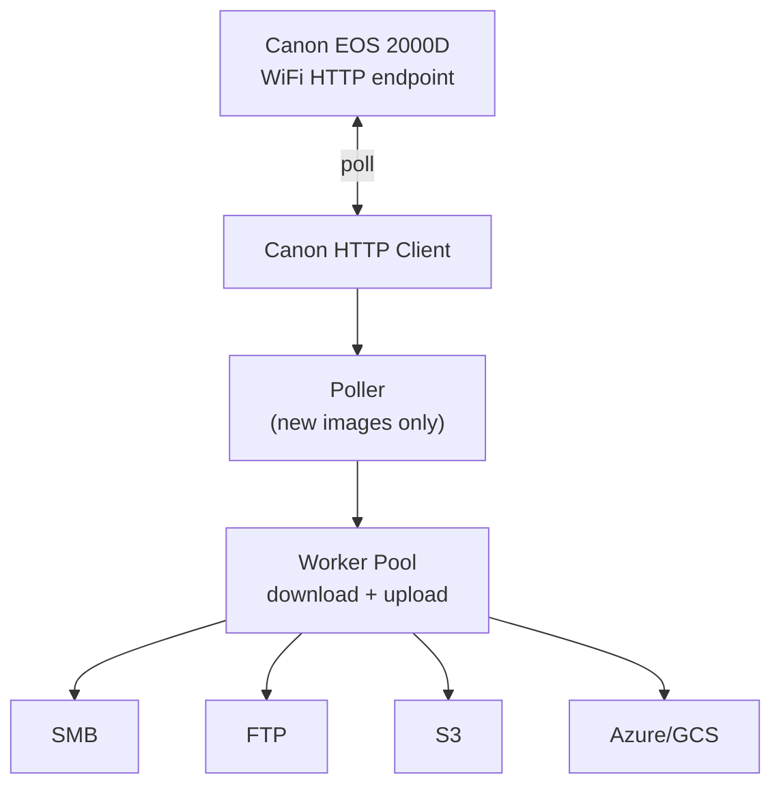

# canon-proxy

`canon-proxy` is a high-performance Go proxy for the Canon EOS 2000D WiFi HTTP interface. It continuously polls the camera for new images and uploads each new file to a configurable backend.

## Features

- Poll Canon EOS 2000D WiFi HTTP interface for image URLs
- Detect only new images (in-memory seen set)
- Parallel download/upload pipeline using worker pool
- Pluggable upload backends:
  - SMB
  - FTP
  - AWS S3
  - Azure Blob Storage
  - Google Cloud Storage
- Graceful shutdown via SIGINT/SIGTERM

## Architecture



## Build

```bash
go mod tidy
go build ./...
```

## Run

```bash
go run ./cmd/canon-proxy --config config.yaml
```

## Docker

```bash
docker build -t canon-proxy .
docker run --rm -v "$(pwd)/config.example.yaml:/app/config.yaml:ro" canon-proxy
```

## Configuration

Copy `config.example.yaml` to `config.yaml` and adjust values.

```yaml
camera:
  host: "192.168.1.100"
  port: 8080
  poll_interval: 5s

upload:
  workers: 4
  backend: smb # smb | ftp | s3 | azure | gcs

backends:
  smb:
    host: "192.168.1.10"
    share: "photos"
    username: "user"
    password: "pass"
    path: "/uploads"
  ftp:
    host: "ftp.example.com"
    port: 21
    username: "user"
    password: "pass"
    tls: false
    path: "/uploads"
  s3:
    bucket: "my-bucket"
    region: "eu-west-1"
    prefix: "canon/"
    access_key: ""
    secret_key: ""
  azure:
    account: "mystorageaccount"
    container: "photos"
    prefix: "canon/"
    sas_token: ""
  gcs:
    bucket: "my-bucket"
    prefix: "canon/"
    credentials_file: "/path/to/sa.json"
```
