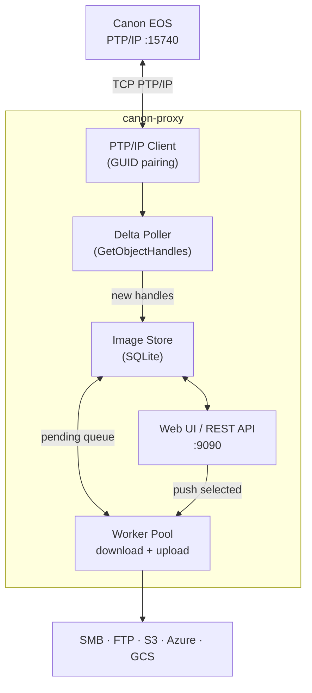

# canon-proxy

[](https://github.com/pacorreia/canon-proxy/releases/latest)
[](https://github.com/pacorreia/canon-proxy/actions/workflows/ci.yml)
[](https://github.com/pacorreia/canon-proxy/pkgs/container/canon-proxy)
[](https://pacorreia.github.io/canon-proxy)
[](LICENSE)

**canon-proxy** is a Go service that connects to a Canon EOS camera over **PTP/IP** (WiFi, TCP :15740), continuously discovers new images, and uploads them to configurable storage backends — fully automated or with a manual review step in the web UI.

## Features

- **PTP/IP protocol** — same GUID-based pairing used by Canon's own apps
- **Delta polling** — only new images are processed each cycle; seen images are tracked in SQLite
- **Video support** — MOV files detected and shown with ▶ badge in the UI
- **Web UI** — thumbnail browser with Grid, By Date, and Timeline views; live Settings editor
- **Upload modes**: `auto` (hands-free) · `manual` (review before upload)
- **Pluggable backends**: SMB · FTP · AWS S3 · Azure Blob · Google Cloud Storage
- **Resilience**: exponential back-off reconnect; optional delete-after-upload
- **Multi-arch container** (`linux/amd64`, `linux/arm64`) on GHCR
- **Helm chart** published to OCI (`ghcr.io/pacorreia/charts/canon-proxy`)

## Quick Start

```bash
cp config.example.yaml config.yaml
# Set camera.host to your camera's IP address

go run ./cmd/canon-proxy --config config.yaml
# Open http://localhost:9090
```

## Docker

```bash
# Default bridge network (recommended — Docker NAT rewrites source to host LAN IP)
docker run --rm \
  -v "$(pwd)/config.example.yaml:/app/config.yaml:ro" \
  -p 9090:9090 \
  ghcr.io/pacorreia/canon-proxy:latest
```

## Kubernetes (Helm)

```bash
helm install canon-proxy \
  oci://ghcr.io/pacorreia/charts/canon-proxy \
  --namespace canon-proxy --create-namespace \
  -f my-values.yaml
```

## Architecture



## Configuration

Copy `config.example.yaml` → `config.yaml` and set `camera.host`. All other settings are editable live from the web UI Settings page and persisted in SQLite.

```yaml
camera:
  host: "192.168.2.70"   # your camera's IP
  port: 15740
  poll_interval: 5s

upload:
  workers: 1
  backend: smb            # smb | ftp | s3 | azure | gcs

backends:
  smb:
    host: "192.168.2.9"
    share: "photos"
    username: "user"
    password: "pass"
    path: "/uploads"
```

See the **[full documentation](https://pacorreia.github.io/canon-proxy)** for all configuration options, backend references, and deployment guides.

## Build

```bash
go mod tidy && go build ./...
```

