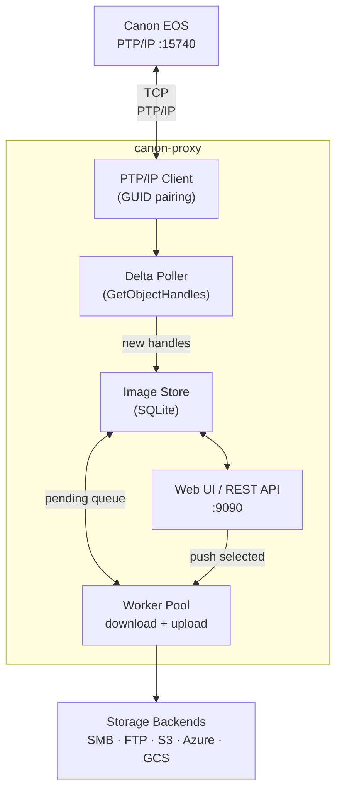

# Architecture

## Overview

canon-proxy is a single stateless binary with an embedded web server. It bridges the camera's PTP/IP socket to your chosen storage backend, with SQLite tracking seen images to guarantee each file is uploaded exactly once.



---

## PTP/IP Handshake

Canon EOS cameras implement a subset of the PTP/IP spec (CIPA DC-X005). The proxy acts as an **Initiator**:

1. TCP connect to `:15740`  
2. Send `InitCommandRequest` with a 16-byte **GUID** and UTF-16LE client name  
3. Camera replies with `InitCommandAck` (connection number) or `InitFail` (reason code)  
4. A second TCP connection is established for the **event channel**  
5. All subsequent PTP operations (GetObjectHandles, GetObjectInfo, GetObject, GetThumb) flow over the command connection

!!! info "GUID pairing is strict"
    The camera enforces pairing by GUID. A single-byte change in the GUID causes `InitFail 0x00000001`. The GUID is fixed at compile time in `internal/canon/client.go`.

---

## Delta Polling

After the first successful scan, the poller switches to delta mode: only handles not yet seen in this process trigger a `GetObjectInfo` call.

SQLite is used to deduplicate discovered URLs across restarts so previously recorded images are not re-queued for upload.

---

## Image Store (SQLite)

The store tracks:

| Column | Description |
|---|---|
| `filename` | Unique file name (e.g. `IMG_0042.JPG`) |
| `url` | `ptpip://<host>:<port>/<handle>` |
| `status` | `discovered` · `queued` · `uploading` · `done` · `failed` |
| `retry_count` | Number of upload attempts so far |
| `last_error` | Last upload/download error message (if any) |
| `next_retry_at` | Back-off time before the next retry |
| `captured_at` | Capture date/time from camera (if available) |
| `is_video` | `true` for MOV/MP4 files |

---

## Worker Pool

Upload workers are goroutines that pick `pending` records from the store, download the full image from the camera, and stream it to the configured backend. Concurrency is controlled by `upload.workers`.

```
pending → [worker] → download from camera → upload to backend → done
                                         └→ error (retried on next poll)
```

---

## Web UI

A single-page application served from an embedded `//go:embed static` filesystem. Features:

- **Grid view** — thumbnails with video badge overlay  
- **By Date view** — images grouped by capture date  
- **Timeline view** — chronological list with status  
- **Settings** — live-edit all configuration without restart  
- **Manual push** — select images and push to backend on demand
